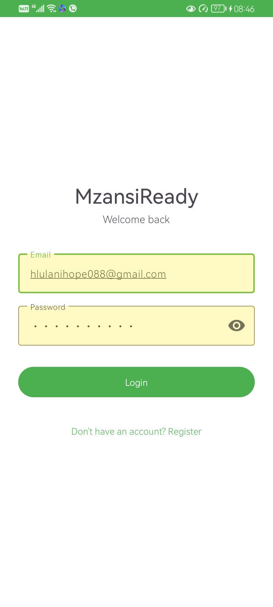
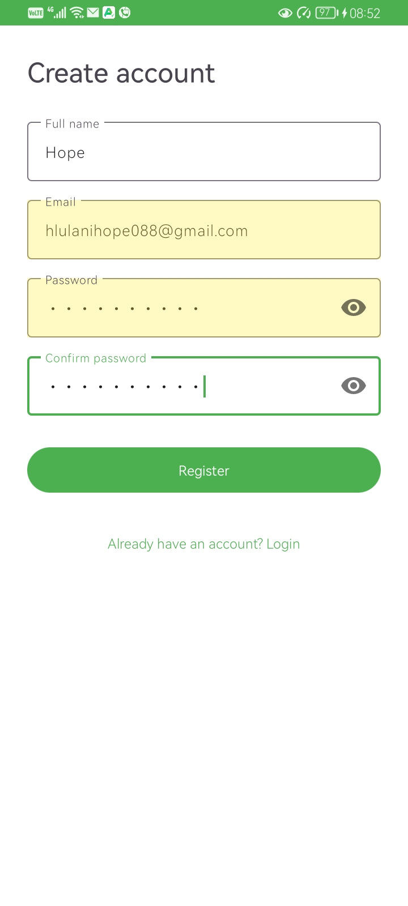
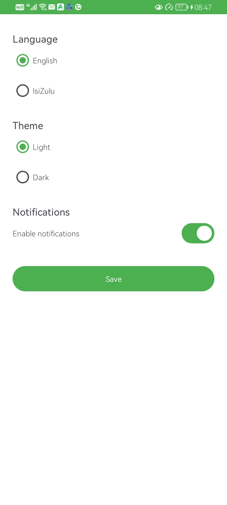
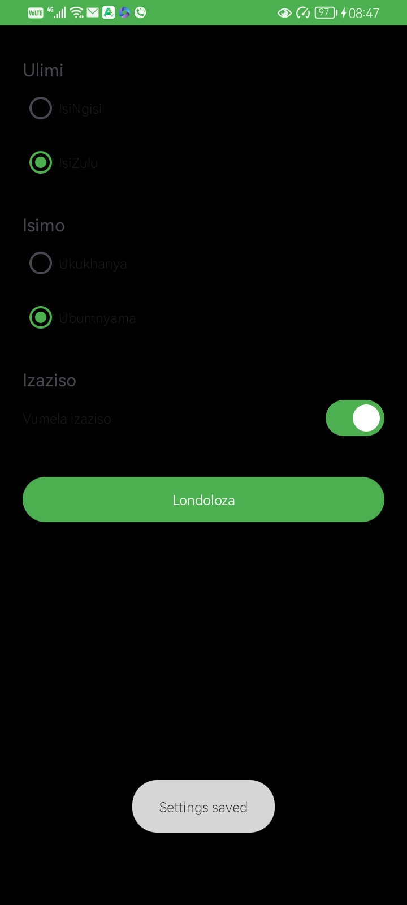
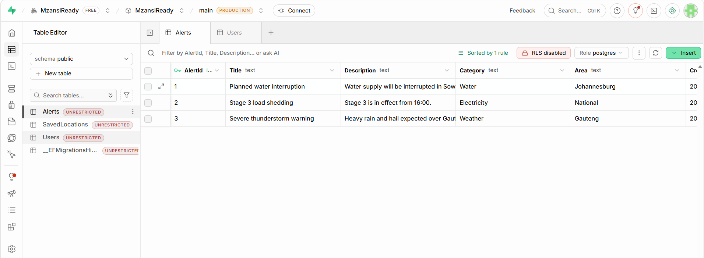
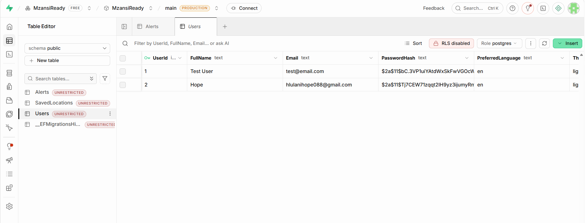

# MzansiReady

A South African daily information and preparedness Android application built with Kotlin, connecting to a custom ASP.NET Core REST API and the Open-Meteo weather service.

---

## 📖 Overview

MzansiReady brings together weather information, community alerts, and daily preparedness data into one simple platform for South African users. The app supports multiple languages, works offline with cached data, and stores user settings both locally and on a remote server.

**Target users:** Students, workers, commuters, and households who need quick access to useful information about their area.

---

## ✨ Features

### User Authentication
- Registration with full name, email, and password
- Login with JWT-based session management
- BCrypt password hashing on the backend
- Secure JWT storage in EncryptedSharedPreferences
- Input validation with user-friendly error messages

### Weather Information
- Live weather data from the Open-Meteo REST API
- Current temperature, condition, min/max temperatures, and rain probability
- WMO weather codes translated to readable descriptions and emojis
- Pull-to-refresh for updates

### Offline Support
- Room database caches weather per location
- Cached data displays when the device is offline
- Automatic sync when connectivity returns

### Multi-Language Support
- English (default)
- isiZulu
- User-selectable from Settings

### Settings
- Language selection (English / isiZulu)
- Theme selection (Light / Dark)
- Notification preferences
- Persisted locally and synced with the backend

### Security
- HTTPS-ready API communication
- Encrypted local storage for JWT
- Input validation on all forms
- Password strength requirements (8+ chars, 1 digit, 1 uppercase)

---

## 🛠️ Tech Stack

### Android App

| Component | Technology |
|-----------|-----------|
| Language | Kotlin |
| Architecture | MVVM (Model-View-ViewModel) |
| UI | XML Layouts, Material 3, ViewBinding |
| Networking | Retrofit 2, OkHttp, Gson |
| Local Storage | Room Database |
| Secure Storage | EncryptedSharedPreferences |
| Async | Kotlin Coroutines, StateFlow |
| Testing | JUnit 4 |

### Backend API

| Component | Technology |
|-----------|-----------|
| Framework | ASP.NET Core 8 |
| ORM | Entity Framework Core |
| Database | PostgreSQL (hosted on Supabase) |
| Authentication | JWT Bearer tokens |
| Hashing | BCrypt.Net-Next |
| Documentation | Swagger (Swashbuckle) |

### CI/CD

- **GitHub Actions** — automated build and unit tests on every push

---

## 🏗️ Architecture

The app follows a layered MVVM architecture:
┌────────────────────────────────────┐
│ UI Layer │
│ Activities with ViewBinding │
├────────────────────────────────────┤
│ ViewModel Layer │
│ StateFlow for reactive state │
├────────────────────────────────────┤
│ Repository Layer │
│ Coordinates API + local cache │
├────────────────────────────────────┤
│ Data Layer │
│ Retrofit (network) + Room (cache)│
└────────────────────────────────────┘

text

### Design Considerations

- **Offline-first**: Local cache is checked first; network requests happen when available
- **Encrypted sessions**: JWT tokens stored using Android Keystore-backed EncryptedSharedPreferences
- **Coroutines**: All I/O operations run on background dispatchers to keep the UI responsive
- **Reactive UI**: StateFlow drives UI updates — no manual refresh needed
- **Type-safe layouts**: ViewBinding eliminates `findViewById` and null-pointer risks
- **Testability**: Repository pattern makes unit testing straightforward
- **Localisation**: All user-facing strings use Android string resources for multi-language support

---

## 🎬 Demo Video

[Watch the full demonstration on YouTube](https://youtu.be/WXBZaKqEBpA)

The video demonstrates:
- User registration and login
- Password hashing (verified in Supabase)
- Live weather from Open-Meteo
- Multi-language switching (English ↔ isiZulu)
- Theme switching (Light ↔ Dark)
- Offline mode with cached weather
- Backend REST API (Swagger)
- Database contents in Supabase

---

## 📸 Screenshots

### Login Screen


### Register Screen


### Home Screen with Live Weather


### Settings (English + Light Theme)


### Home Screen (isiZulu + Dark Theme)


### Settings (isiZulu + Dark Theme)


### Supabase Alerts Table


### Supabase Users Table (Hashed Password)


### Swagger API Endpoints


---

## 🚀 How to Run

### Prerequisites

- Android Studio (Koala or later)
- JDK 17
- Emulator or physical Android device (API 24+)
- The backend API running (see [MzansiReady-API](https://github.com/st10202512/MzansiReady-API))

### Steps

1. **Clone the repository**

   ```bash
   git clone https://github.com/st10202512/MzansiReady.git